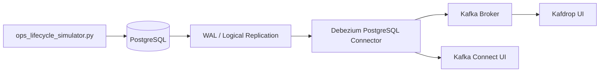

# CDC Learning Project

This project is a small Change Data Capture (CDC) lab built with PostgreSQL, Debezium, Kafka, and Docker.

## What Is CDC

Change Data Capture (CDC) is a pattern for detecting changes made in a database and streaming those changes to other systems in near real time.

Instead of building custom code to publish every insert, update, or delete from the application layer, CDC tools read the database change log and turn those row changes into events.

In this project, PostgreSQL writes changes to WAL, Debezium reads those changes, and Kafka receives them as CDC events.

## What It Does

The setup captures row-level changes from PostgreSQL and publishes them to Kafka through Debezium.

Instead of using a finance feed, the current demo models an operations lifecycle:

- an order is created
- payment is authorized
- the order is packed
- the courier receives it
- the order goes out for delivery
- the order is delivered

These inserts and updates are generated by a local simulator using `Faker`, so you can observe realistic CDC events end to end.

## Main Components

- `postgres`: source database with logical replication enabled
- `kconnect`: Kafka Connect with Debezium PostgreSQL connector
- `broker`: Kafka broker
- `kafdrop`: Kafka topic UI
- `kafka-connect-ui`: Kafka Connect UI

## Architecture



## Project Files

- [docker-compose.yml](./docker-compose.yml): starts Kafka, Debezium, PostgreSQL, and UIs
- [create_ops_tables.sql](./DDL/create_ops_tables.sql): creates the `ops_sys` schema and source tables
- [initdb/01-create-ops-tables.sql](./initdb/01-create-ops-tables.sql): automatically initializes the ops schema on first Postgres startup
- [ops-connector.json](./connectors/ops-connector.json): Debezium connector config for the ops tables
- [ops_lifecycle_simulator.py](./producer/ops_lifecycle_simulator.py): generates insert and update events
- [requirements.txt](./requirements.txt): Python dependencies for running the simulator locally
- [create-connector.sh](./scripts/create-connector.sh): creates the connector in Kafka Connect
- [delete-connector.sh](./scripts/delete-connector.sh): deletes the connector

## Source Tables

The simulator writes to:

- `ops_sys.order_lifecycle`: current state of each order
- `ops_sys.order_events`: event history for each order

Debezium watches both tables and publishes change events to Kafka.

## Workflow

The project workflow is:

1. Docker starts PostgreSQL, Kafka, Kafka Connect, and the UI services.
2. PostgreSQL runs with `wal_level=logical`, which allows Debezium to read changes through logical replication.
3. On first startup, PostgreSQL automatically runs the `initdb` SQL script and creates the `ops_sys` schema and tables.
4. The Debezium connector is created from `ops-connector.json` through the Kafka Connect REST API.
5. `ops_lifecycle_simulator.py` inserts new orders with realistic fake data and updates their lifecycle state over time.
6. PostgreSQL records those changes in WAL.
7. Debezium reads the WAL stream and converts the row changes into Kafka messages.
8. Kafka stores the CDC events in topics such as `ops.ops_sys.order_lifecycle` and `ops.ops_sys.order_events`.
9. You can inspect the connector in Kafka Connect UI and inspect events in Kafdrop.

## How To Run

From the project root:

```bash
cd CDC
python3 -m venv .venv
source .venv/bin/activate
pip install -r requirements.txt
docker compose up -d
bash scripts/create-connector.sh
python3 producer/ops_lifecycle_simulator.py --new-orders 10 --update-cycles 5 --sleep-seconds 5
```

Note: Postgres init scripts run only when the database volume is created for the first time. If you already have an existing `postgres_data` volume, the new init script will not be replayed automatically.

## Simulator Behavior

The simulator currently:

- creates realistic fake order data using `Faker`
- inserts one row per order into `ops_sys.order_lifecycle`
- inserts an event-history row into `ops_sys.order_events`
- updates the same `order_id` through states such as `created`, `payment_authorized`, `packed`, `handover_to_courier`, `out_for_delivery`, and `delivered`
- occasionally produces failure states such as `payment_failed` or `delivery_exception`

Default simulator values:

- `--new-orders 10`
- `--update-cycles 5`
- `--sleep-seconds 5`

## PostgreSQL Replication Checks

You can verify the PostgreSQL CDC prerequisites with:

```sql
select * from pg_replication_slots;

show wal_level;

show max_replication_slots;

show max_wal_senders;
```

What to look for:

- `wal_level` should be `logical`
- `max_replication_slots` should be greater than `0`
- `max_wal_senders` should be greater than `0`
- `pg_replication_slots` should show the slot Debezium creates after the connector starts

In the current setup, Debezium typically creates:

- replication slot: `debezium`
- publication: `dbz_publication`

## Expected Kafka Topics

With the current connector config, you should see topics like:

- `ops.ops_sys.order_lifecycle`
- `ops.ops_sys.order_events`

## Current Scope

The simulator currently demonstrates:

- `INSERT` events
- `UPDATE` events

It does not currently perform hard deletes, so delete CDC events are not part of this demo yet.

## Purpose

This project is intended for learning:

- PostgreSQL logical replication
- Debezium connector setup
- Kafka Connect integration
- CDC event flow from source table to Kafka topic
- modeling business lifecycle changes as database events
